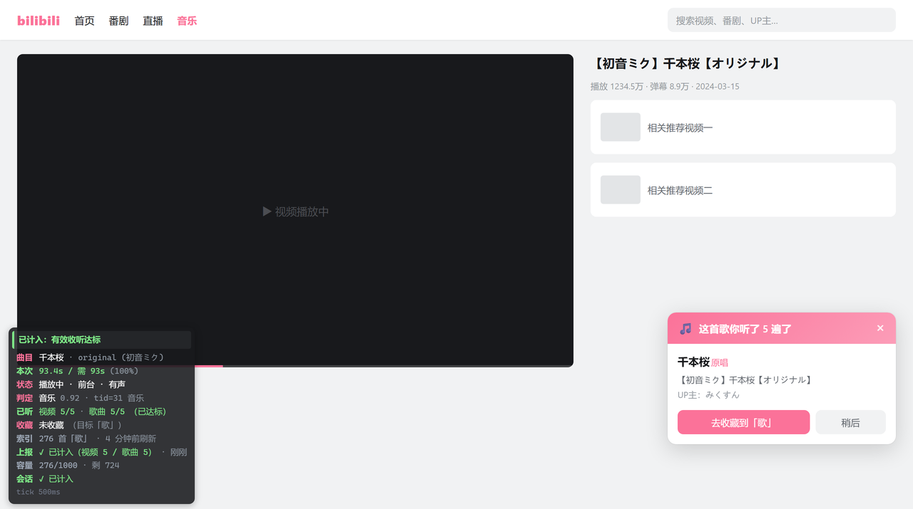
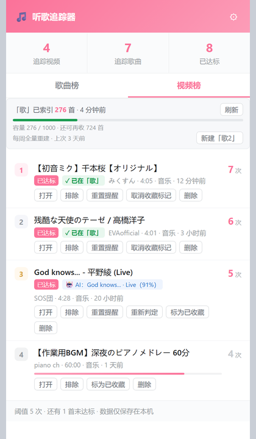
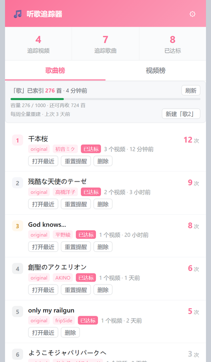
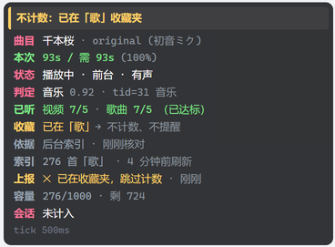
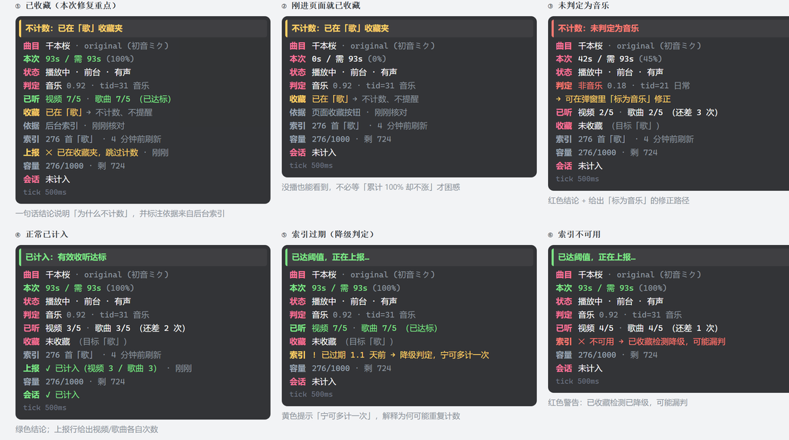

# 听歌追踪器 · Bili Music Tracker

> 一个不打扰你的 Chrome 扩展：在 B 站听到值得留下的歌时，它悄悄记下来，等你说「差不多了」再提醒你收藏。
>
> **本地优先 · 零上传 · AI 可选**

[](#)
[](#)
[](#-测试)
[](./LICENSE)

<br>



<sub>▲ 听满阈值后，B 站页面右下角浮出提醒卡片；左下角是可选的调试面板（Alt+M 开关）。</sub>

<br>

## 目录

- [这是什么](#-这是什么)
- [核心功能](#-核心功能)
  - [1. 自动记录收听](#1-自动记录收听不打扰)
  - [2. 智能识别「这是首歌」](#2-智能识别这是首歌)
  - [3. 已收藏检测](#3-已收藏检测不重复计数)
  - [4. 收藏夹容量管理](#4-收藏夹容量管理与自动换夹)
  - [5. 可选 AI 增强](#5-可选-ai-增强三层降级架构)
- [快速开始](#-快速开始)
- [具体使用方法](#-具体使用方法)
  - [典型示例](#典型示例)
  - [弹窗界面](#弹窗界面)
  - [页面调试面板](#页面调试面板)
- [配置说明](#-配置说明)
- [日语歌支持](#-日语歌支持)
- [目录结构](#-目录结构)
- [技术架构](#-技术架构)
- [测试](#-测试)
- [常见问题](#-常见问题)
- [已知限制](#-已知限制)
- [变更记录](#-变更记录)
- [相关文档](#-相关文档)

---

## 这是什么

你在 B 站后台挂着歌单干活，一挂就是一下午。有几首歌你反复回来听，但从来没想起来收藏 —— 过两周就再也找不到了。

这个扩展解决的就是这件事：

```
你听歌          →  它默默计数              →  听满 5 次
                     （不打扰、不弹窗）         ↓
                                          右下角浮出卡片：
                                          「这首你听了 5 遍了，收藏吗？」
                                                    ↓
                                          点一下 → 自动帮你定位到「歌」收藏夹
```

### 设计原则

| 原则 | 具体表现 |
|---|---|
| **本地优先** | 所有记录存在 `chrome.storage.local`，**不经过任何服务器** |
| **不越权** | 不代你点收藏、不调用写接口改你的账号数据 |
| **不打扰** | 平时完全静默；只有达到阈值才出现一次卡片；已收藏的歌不再重复提醒 |
| **永远可用** | AI 挂了、B 站改版了，规则引擎都会兜底，扩展不会因此失效 |

---

## 核心功能

### 1. 自动记录收听（不打扰）

打开任意 B 站视频页播放即可，**不需要任何操作**。

**什么算「听了一次」**（默认值，可在设置里改）：

```
累积有效收听 ≥ max(30 秒, 视频时长 × 30%)     ← 两个条件取较大者
         或
听完了 85% 以上
```

❌ **不计数**的情况：

| 行为 | 为什么不算 |
|---|---|
| 只听了 3 秒就切走 | 未达最少有效时长 |
| 拖着进度条乱拉 | 只计入与墙钟时间相符的部分 |
| 暂停着不动 | 视频进度未推进 |
| 静音时播放 | 可开关（默认静音也计时） |

> **后台标签页也能正确计数**。Chrome 会把隐藏标签页的定时器节流到每分钟 1 次，
> 所以本项目用**视频进度推进量**（`currentTime` 增量）累计，而不是墙钟 tick 间隔。
> 详见 [变更记录 · v1.2.1](#v121--修复后台播放不计数)。

**两级计数**（可分别开关）：

- **视频级** —— 同一个 BV 号听了几次（`BV1xx...`）
- **歌曲级** —— 同一首歌跨视频合并（`千本桜|原唱`、`千本桜|翻唱`）

### 2. 智能识别「这是首歌」

不是所有 B 站视频都是歌。扩展用**加权打分**判断，四个信号来源：

| 信号 | 说明 |
|---|---|
| **分区 tid / tname** | 音乐区是最强信号（但很多音乐视频挂在游戏区、番剧区，所以不能只看这个） |
| **标题关键词** | `翻唱` / `cover` / `歌ってみた` / `MV` / `原曲` / `插入曲` / `OST` … |
| **UP 主名字** | 企划实体（BanG Dream / Love Live! / 初音ミク / 偶像大师 …） |
| **视频时长** | 异常长的（> 30 分钟）多为合辑，单独处理 |

**三档结果**：

- ✅ **确定是音乐** → 正常计数
- ⚠️ **疑似非音乐** → 默认**不计入**（可在设置里打开，或手动「标为音乐」）
- 📚 **合辑**（歌单 / メドレー / 作業用BGM / > 30 分钟）→ **跳过歌曲级计数**，避免一次听十几首污染歌曲榜

**解析示例**：

```
【初音ミク】千本桜【オリジナル】      → 歌名:千本桜   歌手:初音ミク  版本:原唱
【ピアノ】千本桜                     → 歌名:千本桜   歌手:-        版本:钢琴版 ★
【MV】King Gnu - 白日                → 歌名:白日     歌手:King Gnu
Aimer - 残響散歌 / THE FIRST TAKE    → 歌名:残響散歌（节目名已剥离）
```

> ★ 这是最关键的修复：早期版本会把 `【ピアノ】千本桜` 当成**原曲**计数 ——
> 等于你听 5 次钢琴版，插件以为你在听原曲。现在版本标记会独立出来。

### 3. 已收藏检测（不重复计数）

**解决的问题**：旧版只看「听了几遍」，不知道这首歌**是不是已经在「歌」收藏夹里了**。
结果是一首早就收藏过的歌，每次再听都还在累加计数、还会反复弹卡片。

**三层判定，从快到准**：

| 层 | 机制 | 特点 |
|---|---|---|
| **L1** | 本地索引 `favIndex` / `favIndexes` | 主力。零延迟、零网络请求 |
| **L2** | 页面 DOM 收藏状态 | 兜底。你刚点完收藏、索引还没刷新时也能立刻感知 |
| **L3** | 后台定时重建 | 每 30 分钟常规刷新 + **每 7 天全量重建** |

命中则：

- 🚫 **不计数**（视频级、歌曲级都不加）
- 🚫 **不弹卡片**（直接标为已提醒）
- 💬 右下角一句轻提示：`这首已在「歌」收藏夹，不再计数 ✓`

<p align="center">
  
</p>

<sub align="center">▲ 视频榜里，`✓ 已在「歌」` 是索引命中的已收藏标记；`🤖 AI: … (91%)` 是 AI 判定结果与置信度。</sub>

**为什么需要每周全量重建？**

索引是「只增不减」的 —— 增量刷新只知道你**加了**什么。如果你在 B 站网页端**手动删了**收藏，
插件无从感知，索引会永久偏大，于是那首歌被判成「已收藏」而**再也不计数**。每周重建能纠正这种漂移。

> ⚠️ **安全设计：过期索引不参与命中**。索引一旦超过 24 小时就视为不可信，
> 自动降级到 DOM 判定 + 触发后台刷新 —— **宁可多计一次，也不要因为陈旧数据永久丢失计数**。

**实现细节（为什么不用官方那个接口）**：

| 接口 | 能否用 | 原因 |
|---|---|---|
| `/x/v3/fav/resource/ids?bvid=xxx` | ❌ | 需要 WBI 签名，未签名恒返回 `{"code":-400}` |
| `/x/v3/fav/resource/list?media_id=xx` | ✅ | **不需要签名**，分页拉全量即可 |

所以本项目采用「**拉全量建索引**」方案 —— 「歌」收藏夹 276 条只需 14 个请求，
之后每次判定都是本地 `Set.has()`，零成本。

**精确匹配收藏夹名**：实测账号下可能同时存在 `歌` 和 `歌？` 两个收藏夹。
索引器会**排除带 `? ？ ! ！` 结尾的干扰项**，精确锁定真正的「歌」；
若真存在多个同名夹，取内容最多的那个。

### 4. 收藏夹容量管理与自动换夹

**B 站容量上限（已核实）**：

| 收藏夹类型 | 单夹容量上限 |
|---|---|
| **自建收藏夹** | **1000 首** |
| 默认收藏夹 | 50000 首 |

弹窗顶部实时显示容量条：

<p align="center">
  
</p>

<sub align="center">▲ 索引状态条：「歌」已索引 276 首 · 4 分钟前；下方是容量条 <code>276 / 1000 · 还可再收 724 首</code>；右侧「新建『歌2』」在接近满时可用。</sub>

- **< 90%** → 绿色
- **≥ 90%** → 黄色，提示剩余数量
- **= 100%** → 红色，提示你去建新夹

**「歌」满了怎么办？** 不需要改任何设置，机制是**命名约定**：

```
「歌」满 1000 首  →  你新建一个「歌2」  →  插件自动纳入
                                        ├─ 索引覆盖两夹（在任一夹都算已收藏）
                                        ├─ 收藏目标指向第一个没满的夹
                                        └─ 容量条显示整条夹链
```

**命名规则**：`基础名 + 数字`，即 `歌2`、`歌3`…（**不能有空格**）。
带 `? ？ ! ！` 结尾的仍排除，所以「歌？」永远不会被误纳入。

**建夹三种方式**：

1. 弹窗里点 **「新建『歌2』」** 按钮 —— 插件调接口直接建，建完自动打开
2. 页面卡片上点 **「新建『歌2』」** —— 检测到全满时会主动弹引导卡
3. 手动去 B 站「我的收藏 → 新建收藏夹」建好，回来点「刷新」

> ⚠️ 自动建夹失败时（未登录 / 数量达上限 / 风控），插件会**明确提示失败原因**并引导手动创建，
> **不会静默失败**。另外「自建收藏夹**个数**上限」B 站从未公开（社区说法 50/99/100 不一），
> 所以插件只给保守提示，**以页面实际报错为准**。

### 5. 可选 AI 增强（三层降级架构）

**默认关闭**，纯本地规则运行，零成本零延迟。打开后只有规则引擎拿不准的标题才交给 AI：

```
┌─────────────────────────────────────────────────────┐
│ 第 1 层  本地规则        < 1ms                       │
│          置信度 ≥ 0.85 → 直接采纳，根本不问 AI        │
├─────────────────────────────────────────────────────┤
│ 第 2 层  AI 判定         0.5 ~ 5s                    │
│          成功 → 采纳 + 永久缓存                       │
├─────────────────────────────────────────────────────┤
│ 第 3 层  规则结果兜底                                 │
│          任何失败都退回规则，插件永远可用              │
└─────────────────────────────────────────────────────┘
```

**两种通道**：

| 通道 | 插件存 Key | 实时性 | 适合 |
|---|---|---|---|
| **队列中转**（推荐） | ❌ 不存 | 手动触发 | 更安全，把队列复制给 AI 处理 |
| **直连 API** | ✅ 明文存本地 | 实时生效 | 免手动，建议用**权限受限的子 Key** |

**成本**：配合永久缓存，一个月重度使用 ≈ **¥0.16**（详细测算见 [DESIGN-AI.md](./DESIGN-AI.md)）。

**AI 怎么改数**：AI 结果晚于计数到达，所以采用「**乐观计数 + 回溯修正**」——
先用规则结果记上，AI 回来后若判定不同，会**扣减或迁移**那一次计数。

```
规则判成  初音ミク|original  记了一次
AI 纠正为 千本桜|original
         ↓
计数从 初音ミク|original  迁移到  千本桜|original
```

这条链路是**幂等**的 —— 重复导入同一份结果不会重复扣减。

---

## 快速开始

### 前置要求

- Chrome / Edge 等 Chromium 内核浏览器（**136+ 版本**）
- 已登录的 B 站账号（已收藏检测需要）

### 安装（开发者模式加载）

> ⚠️ **先明确一件事**：`chrome://extensions/` 的「加载已解压的扩展程序」**只接受文件夹，不接受 `.zip`**。
> 你没法把压缩包直接拖进浏览器安装 —— Chrome 不会替你解压。**必须先解压**。

#### 方式 A：下载 Release 压缩包（推荐普通用户）

1. 到 [Releases](https://github.com/zqjin0828/bili-music-tracker/releases) 下载最新的
   `bili-music-tracker-v1.3.2.zip`
2. **解压**到一个固定目录（比如 `%USERPROFILE%\bili-music-tracker`）
3. 打开 `chrome://extensions/` → 右上角开「**开发者模式**」
4. 点左上角「**加载已解压的扩展程序**」→ 选择**解压出的那个文件夹**
5. 首次加载会请求 **Cookie** 权限（用于读取 `bili_jct` 以支持一键新建收藏夹），点「允许」

**可选：用脚本自动完成 2、3 步**

把 `tools/install.ps1` 和 zip 放在同一目录，然后运行：

```powershell
powershell -ExecutionPolicy Bypass -File .\install.ps1
```

脚本会：校验 zip → 解压到 `%USERPROFILE%\bili-music-tracker` → 检查 8 个关键文件是否齐全
→ 把路径复制到剪贴板 → 自动打开 `chrome://extensions/`。
你只需要点「加载已解压的扩展程序」然后 `Ctrl+V` 粘贴路径。

#### 方式 B：克隆源码（推荐开发者）

```bash
git clone git@github.com:zqjin0828/bili-music-tracker.git
cd bili-music-tracker
```

然后在浏览器里加载 `bili-music-tracker` 文件夹本身即可，无需打包。

#### 为什么不能做「一键安装」

| 方式 | 可行性 |
|---|---|
| 拖 `.zip` 进扩展页 | ✗ Chrome 不解压，无反应或报错 |
| 拖 `.crx` 进扩展页 | ✗ **Chrome 136+ 已彻底关闭**（本项目正要求 136+） |
| 上架 Chrome Web Store | 需 $5 开发者费 + 审核，且本项目会读 B 站 Cookie，审核风险高 |
| 上架 Edge Add-ons | 免费、审核较快，代码可通用 —— 但同样卡权限审核 |
| **开发者模式加载文件夹** | ✓ 本项目采用此方式 |

安装成功后，扩展图标上会显示**当前最高播放次数**。

> 💡 **更新已有版本**：回到 `chrome://extensions/`，点扩展卡片上的**刷新图标**，
> 然后刷新 B 站页面（content script 需要重新注入）。
>
> 💡 **v1.3.1 起需要 `cookies` 权限**。如果你装的是 v1.3.0 及更早版本，升级后需重新授权。

### 初始化收藏夹索引

安装后自动开始建索引（异步，不阻塞）。首次可手动触发：

```
点扩展图标 → 顶部索引状态条右侧「刷新」
```

索引完成后会显示：`「歌」已索引 N 首 · 刚刚`

---

## 具体使用方法

### 典型示例

#### 示例 1：日常听歌，达到阈值后收藏

```
① 打开 https://www.bilibili.com/video/BV1xxx  播放
   └─ 左下角出现调试面板：累计 12s / 需要 93s

② 后台挂着继续干活，听满 93 秒
   └─ 计数 +1，图标数字变化

③ 反复回来听，第 5 次达到阈值
   └─ 右下角浮出卡片：
      ┌──────────────────────────────────────┐
      │ 🎵  这首歌你听了 5 遍了          ×   │
      │                                      │
      │ 千本桜 · 翻唱                        │
      │ 初音ミク                             │
      │                                      │
      │  [去收藏到「歌」]      [稍后]         │
      └──────────────────────────────────────┘

④ 点「去收藏到『歌』」
   └─ 自动展开 B 站收藏面板，「歌」这一项被高亮并滚动到中间
   └─ 你勾选它 → 点确定

⑤ 收藏成功
   └─ 插件检测到按钮变「已收藏」，立刻写进本地索引
   └─ 提示：已收藏 ✓ 计入索引，之后不再重复计数
```

#### 示例 2：已收藏的歌不再打扰

```
你收藏过的《千本桜》又被播放了 5 遍
                 ↓
     插件在计数前先查本地索引
                 ↓
        命中「歌」收藏夹 → 不计数
                 ↓
   右下角只需飘过一句：这首已在「歌」收藏夹，不再计数 ✓
```

#### 示例 3：「歌」收藏夹满了

```
「歌」达到 1000 首
                 ↓
     弹窗容量条变红：容量 1000 / 1000 · 已满！
                 ↓
   ┌────────────────────────────────────┐
   │ 📁  「歌」已满 1000 首         ×   │
   │                                    │
   │ 要不要新建一个「歌2」继续收藏？     │
   │ B站单个自建收藏夹上限 1000 首。     │
   │ 新建后插件会自动纳入索引与收藏目标  │
   │                                    │
   │ [新建「歌2」]      [我自己去建]     │
   └────────────────────────────────────┘
                 ↓
          点「新建『歌2』」
                 ↓
     接口创建成功 → 索引自动刷新 → 打开新夹
                 ↓
   之后：已收藏检测同时查「歌」和「歌2」
        收藏目标自动指向没满的那个
```

#### 示例 4：中文标题解析不准，手动纠正

```
标题：【4K】周杰倫 - 晴天 (Live 版) 官方MV

解析结果：歌名=晴天  歌手=周杰倫  版本=live
                          ↓
     如果你希望 Live 版**单独计数**（不和原曲合并）
                          ↓
     设置 → 关掉「Live/重制版并入原曲计数」
```

#### 示例 5：用队列模式接 AI（不暴露 Key）

```
① 设置 → AI 判定 → 通道选「队列中转」

② 听歌时，规则拿不准的视频自动进队列

③ 处理队列（二选一）：
   a) 弹窗点「复制队列」→ 直接粘给 AI 助手
   b) 命令行：node tools/process-queue.js --in queue.json --out results.json

④ 拿到结果 → 弹窗点「导入 AI 结果」→ 选择结果文件
   └─ 显示：已应用 N 条，跳过 M 条
```

### 弹窗界面

点扩展图标打开。左：**歌曲榜**（默认视图）；中：**视频榜**；右：**设置面板**。

<table>
<tr>
<td width="33%"></td>
<td width="33%"></td>
<td width="33%"></td>
</tr>
<tr>
<td align="center"><b>歌曲榜</b><br><sub>按「歌名+版本」聚合<br>带容量条与「新建『歌2』」</sub></td>
<td align="center"><b>视频榜</b><br><sub>按 BV 号独立计数<br>带 <code>✓ 已在「歌」</code> 与 <code>🤖 AI</code> 徽章</sub></td>
<td align="center"><b>设置面板</b><br><sub>阈值 / 收藏夹 / 索引<br>计数口径 / AI 判定</sub></td>
</tr>
</table>

**两个榜单的区别**：

| 榜单 | 聚合方式 | 用途 |
|---|---|---|
| **歌曲榜** | 按「歌名 + 版本」聚合，跨 UP 主合并同名翻唱 | 看「我喜欢什么歌」 |
| **视频榜** | 按 BV 号独立计数 | 看「哪个视频我听得多」 |

**每条记录可做的操作**：

| 操作 | 说明 |
|---|---|
| 打开 / 打开最近 | 跳到原视频 |
| 标为音乐 | 修正误判（用于「疑似非音乐」的项） |
| 排除 / 恢复 | 从统计中剔除（不会删除记录） |
| **标为已收藏 / 取消收藏标记** | 手动修正已收藏状态 |
| 重置提醒 | 让提醒卡片能再次弹出 |
| 重新判定 | 用 AI 重新判定这一条 |
| 删除 | 彻底删除记录（不可恢复） |

### 页面调试面板

在 B 站视频页按 **`Alt + M`** 切换左下角面板（也可在设置里 `显示调试面板` 常驻开关）。

它是排查「**这首为什么没计数**」的唯一现场。**只要处于不会计数的状态，第一行就直接给出结论**，不用自己推理：

<p align="center">
  
</p>

上面这块：第一行黄色结论 `不计数：已在「歌」收藏夹` 直接点明原因，下面 `收藏`/`依据` 两行说明依据来自后台索引、刚刚核对过，`上报` 行则是后台的实际返回。

**各行含义**：

| 行 | 含义 |
|---|---|
| **顶部结论** | ★ 只在异常时出现。一句话说明「会不会计数、为什么」。黄 = 不计数但符合预期（已收藏 / 静音 / 索引过期），红 = 非预期（非音乐 / 索引不可用 / 夹满），绿 = 正常已计入 |
| `曲目` | 解析出的「歌名 · 版本 (艺人)」 |
| `本次` | **本次会话**的有效收听进度。`93s / 需 93s (100%)` 表示这一段已经听够了 |
| `状态` | 播放中 / 暂停 / 结束，前台 / 后台，有声 / 静音，非 1 倍速时标注倍速 |
| `判定` | 本地规则结果：音乐 / 非音乐、置信度、`tid=31`（B 站音乐分区） |
| `已听` | **历史累计次数**，决定何时弹卡。`视频 7/5 · 歌曲 7/5` 表示视频级和歌曲级都已达标 |
| `收藏` | 是否已在收藏夹。`已在「歌」→ 不计数、不提醒` 表示命中已收藏 |
| `依据` | 收藏判定来自哪里：`后台索引` / `页面收藏按钮`（DOM 优先，更实时） |
| `索引` | 收藏夹索引状态与条数。`不可用`（红）或`已过期`（黄）时会说明已降级 |
| `上报` | 上一次上报给后台的结果：`✓ 已计入（视频 3 / 歌曲 3）` 或 `✕ 已在收藏夹，跳过计数` |
| `容量` | 「歌」收藏夹占用。满时提示收藏目标已改为「歌2」 |
| `丢弃` | ★ 解释**秒数为什么不动**：拖动进度被截断几次、静音多少秒、进度停滞几次 |
| `AI` | AI 判定情况：已应用（含曲名/版本/把握度与理由）、调用失败已降级、或队列中待判定 |
| `会话` | 本次会话是否已计入（防重复计数） |

**常见特殊状态一览**（同一份渲染代码，真实 `src/hud.js` 输出）：

<p align="center">
  
</p>

**Console 日志**（F12 过滤 `[BiliMusicTracker]`）：

```
解析结果 {songName: "千本桜", artist: "初音ミク", version: "翻唱"}
判定 {isMusic: true, confidence: 0.92, reason: "..."}
已记录一次播放 {videoPlayCount: 3, songPlayCount: 3}
已收藏，跳过计数 index
```

**后台日志**：`chrome://extensions/` → 找到扩展 → 点 **「Service Worker」** 链接。

---

## 配置说明

点扩展弹窗右上角 **⚙** 打开设置面板。

### 计数设置

| 选项 | 默认 | 说明 |
|---|---|---|
| 触发阈值 | **5** | 听几次提醒收藏 |
| 收藏夹名称 | **歌** | 提醒时定位的收藏夹名 |
| 视频级计数 | 开 | 同一 BV 号听几次 |
| 歌曲级计数 | 开 | 同名翻唱跨视频合并 |
| Live/重制并入原曲 | 开 | 关掉则 Live 版分开计 |
| 疑似音乐计入 | 关 | 打开后判定不确定的也统计 |
| 静音也计时 | 开 | 关掉则静音时不累计 |
| 最少有效收听 | **30 秒** | 低于这个时长不算一次 |
| 有效收听比例 | **0.3** | 需听满视频时长的 30% |

> ⚠️ **门槛口径**：实际门槛 = `较大者(最少秒数, 时长 × 比例)`。
> 例：5 分钟的歌按 0.3 算 → 需听满 **93 秒**，不是 30 秒。

### 已收藏检测设置（v1.3+）

| 选项 | 默认 | 说明 |
|---|---|---|
| 已在收藏夹的歌不再重复计数/提醒 | 开 | 总开关 |
| 「歌」满了自动改用「歌2」「歌3」… | 开 | 多夹滚动 |
| 每周全量重建一次收藏夹索引 | 开 | 纠正索引漂移 |
| 索引刷新间隔 | **30** 分钟 | 5 ~ 1440 |

### AI 判定设置（v1.2+，可选）

| 选项 | 默认 | 说明 |
|---|---|---|
| 判定通道 | 关闭 | `关闭` / `队列中转` / `直连 API` |
| 置信度阈值 | **0.85** | 高于此值不调 AI（省 token 的关键） |
| 永久缓存 | 开 | 每个视频只问一次 |
| API 端点 | — | 仅直连模式（OpenAI 兼容） |
| API Key | — | 仅直连模式 |
| 模型名 | gpt-4o-mini | 仅直连模式 |
| 超时 | 10000 ms | 仅直连模式 |

详细接入步骤见 **[AI-SETUP.md](./AI-SETUP.md)**。

### 关于「翻唱版本」的计数口径

| 情况 | 处理 | 结果 |
|---|---|---|
| 不同人翻唱同一首歌 | **合并** | `千本桜\|翻唱` |
| 原唱 vs 翻唱 | **分开** | `千本桜\|original` vs `千本桜\|翻唱` |
| Live 版 vs 录音室版 | 默认**合并**（可关） | — |

### 数据管理

- 全部数据仅存本机 `chrome.storage.local`
- 弹窗底部：**导出数据**（下载 JSON）/ **导入数据** / **清空全部**
- 建议偶尔导出备份 —— 清理浏览器数据会丢掉记录

---

## 日语歌支持

日语歌的标题格式跟中文差别很大，v1.1 做了专项适配。

**支持的日语版本标记**：

| 日语写法 | 识别为 |
|---|---|
| `歌ってみた` / `弾いてみた` / `カバー` / `演奏してみた` | 翻唱 |
| `オリジナル` / `本家` | 原唱 |
| `ピアノ` / `ギター` / `アコースティック` | 钢琴版 / 吉他版 / Acoustic |
| `カラオケ` / `インスト` / `オフボーカル` | 纯音乐（伴奏） |
| `ライブ` / `生歌` | Live |
| `リミックス` / `アレンジ` | Remix |
| `替え歌` / `パロディ` | 替え歌 |
| `セルフカバー` / `リアレンジ` | Remake |

**实测效果**：

```
【初音ミク】千本桜【オリジナル】      → 千本桜    / 初音ミク  / 原唱
【ピアノ】千本桜                     → 千本桜    / -         / 钢琴版 ★
YOASOBI「夜に駆ける」                → 夜に駆ける / YOASOBI
【MV】King Gnu - 白日                → 白日      / King Gnu
Neru - 東京テディベア feat.鏡音リン   → 東京テディベア（feat.已剥离）
Aimer - 残響散歌 / THE FIRST TAKE    → 残響散歌（节目名已剥离）
```

**合辑自动排除**：

`【作業用BGM】アニソンメドレー`、`【3時間】作業用 邦楽メドレー` 这类是多首歌的集合，
会识别为**合辑**并**跳过歌曲级计数**（仍计入视频级），避免污染歌曲榜。

**不会被误判的标签**：

`【MV】【MAD】【フル】【練習】【合唱】【東方】【洋楽】【歌枠】【ED】【OP】` 等
视频格式/出处标签不会被当成歌手名。

---

## 目录结构

```
bili-music-tracker/
│
├── manifest.json              # 扩展清单（Manifest V3）
├── background.js              # ★ Service Worker：计数、持久化、阈值判定、
│                              #   收藏夹索引、AI 调度与回溯修正
│
├── src/                       # 内容脚本与共享模块
│   ├── parser.js              #   标题 → 歌名 / 歌手 / 版本，生成 songKey
│   ├── detector.js            #   音乐判定加权打分（tid + 标题 + UP + 时长）
│   ├── fav-index.js           #   ★ 收藏夹索引：pickFolder / isFaved /
│   │                          #     capStatus / pickUsableFolder / nextOverflowName
│   ├── ai.js                  #   AI 模块：prompt 构建、响应解析、版本归一化
│   ├── ai-client.js           #   AI 调度：三层决策、直连调用、回溯修正计划
│   ├── hud.js                 #   ★ 调试面板渲染（纯函数，特殊状态结论 / 染色）
│   ├── content.js             #   播放监听、有效时长采样、元数据采集、提醒卡片
│   └── card.css               #   卡片与 Toast 样式
│
├── popup/                     # 扩展弹窗
│   ├── popup.html             #   面板结构（统计 / 榜单 / 索引状态 / 设置）
│   ├── popup.css              #   弹窗样式
│   └── popup.js               #   弹窗逻辑
│
├── tools/                     # 开发与运维脚本
│   ├── pack.js                #   ★ 打包扩展 zip（自动推导清单 + 双向引用自检）
│   ├── verify-zip.js          #   ★ 校验 zip：逐条解压字节比对 + 引用完整性
│   ├── install.ps1            #   ★ 用户侧一键安装（校验/解压/检查/复制路径/开扩展页）
│   ├── process-queue.js       #   队列处理（调 API 并产出结果文件）
│   ├── demo-queue.json        #   演示用队列样本
│   ├── analyze-tids.js        #   分区 tid 分布分析
│   ├── validate-detector.js   #   用真实样本校验判定器准确率
│   ├── diag-count.js          #   计数诊断
│   ├── find-extension.js      #   定位已安装扩展目录
│   ├── probe-ext-load.js      #   探测扩展加载
│   ├── probe-sw-fetch.js      #   探测 SW 网络请求能力
│   └── mini-check.js          #   快速自检
│
├── test/                      # 测试套件
│   ├── run-all.js             #   总入口（进程内 require，适配受限沙箱）
│   ├── test-parser.js         #   87 项 · 标题解析 / 判定 / 日语
│   ├── test-ai.js             #   90 项 · prompt / 响应解析 / 归一化
│   ├── test-ai-client.js      #   44 项 · 调度 / API 兼容 / 幂等
│   ├── test-integration.js    #   31 项 · 端到端 8 场景
│   ├── test-service-worker.js #   74 项 · 真实 background.js 在 VM 里跑
│   ├── test-fav-index.js      #   52 项 · 收藏夹索引 / 容量 / 多夹
│   ├── test-detector-accuracy.js # 14 项 · 对人工核对样本的召回/精确
│   ├── test-background.js     #   11 项 · 后台计时 / seek / 倍速
│   ├── test-hud.js            #   ★ 65 项 · 调试面板渲染（纯函数，特殊状态全覆盖）
│   ├── test-content-hud.js    #   ★ 33 项 · content.js ↔ 面板联动（VM 里真实跑内容脚本）
│   ├── browser-test.js        #   浏览器内测试页
│   └── fixtures/              #   测试样本数据
│
├── icons/                     # 图标（16 / 48 / 128）
│
├── DESIGN.md                  # 原本地规则方案设计
├── DESIGN-AI.md               # AI 接入方案（架构 / prompt / 成本 / 降级）
├── AI-SETUP.md                # AI 接入实操步骤
├── README.md                  # 本文档
├── README.old.md              # 旧版 README（历史留存）
├── LICENSE                    # MIT
└── .gitignore
```

**打包产物**：

```bash
node tools/pack.js
# → dist/bili-music-tracker-v1.3.2.zip
```

打包脚本会**从 manifest 自动推导清单**并做**自检** ——
manifest 声明但没打进包的文件会导致构建失败（这个机制曾抓出过一个幽灵文件声明）。

---

## 技术架构

```
┌─────────────────────────── B 站页面 ───────────────────────────┐
│                                                                │
│  content.js                                                    │
│    ├─ 监听 <video>：currentTime 增量累计有效收听时长            │
│    ├─ 采集元数据：__INITIAL_STATE__ → URL → DOM → playlist      │
│    └─ 提醒卡片 / Toast / 调试面板（Alt+M）                     │
│                                                                │
└────────────────────────────┬───────────────────────────────────┘
                             │ chrome.runtime.sendMessage
┌────────────────────────────▼───────────────────────────────────┐
│                      background.js (Service Worker)            │
│                                                                │
│  recordPlay()  ── 收口函数                                     │
│    ├─ ① 已收藏检测 → 命中则不计、不提醒  ★ v1.3                │
│    ├─ ② 视频级计数（按 BV 号）                                 │
│    ├─ ③ 歌曲级计数（按 songKey，合辑跳过）                     │
│    └─ ④ 阈值判定 → 通知 content 弹卡片                         │
│                                                                │
│  AI 三层调度                                                   │
│    ├─ 规则置信度 ≥ 阈值 → 直接采纳                             │
│    ├─ 否则调 AI（直连 / 入队）                                 │
│    └─ 失败降级为规则结果                                       │
│                                                                │
│  收藏夹索引                                                    │
│    ├─ favIndexRefresh   alarm（30 分钟）                       │
│    ├─ favIndexWeekly    alarm（7 天，全量重建）  ★ v1.3.1      │
│    └─ favIndexes：主夹 + 溢出夹（歌2 / 歌3 …）                 │
│                                                                │
└────────────────────────────┬───────────────────────────────────┘
                             │
                   chrome.storage.local
                    （全部数据存在本机）
```

**关键技术决策**：

| 决策 | 原因 |
|---|---|
| 用 `currentTime` 增量而非墙钟 tick | 后台标签页定时器被节流到 1 次/分钟，墙钟方案会恒为 0 |
| 拉全量建索引而非单条查 | `resource/ids` 需要 WBI 签名，未签名恒 -400 |
| 过期索引不参与命中 | 索引只增不减，陈旧数据会导致永久漏计 |
| 每周全量重建 | 感知不到网页端手删收藏，只能靠周期性全量纠正 |
| `run-all.js` 用进程内 require | 受限沙箱里 `spawnSync` 报 `EBUSY`，且进程内更快 |

---

## 测试

```bash
node test/run-all.js          # 全部套件（449 项断言）
node test/test-hud.js          # 单跑调试面板（65 项）
node test/test-parser.js      # 单跑某一套
```

| 套件 | 断言 | 覆盖内容 |
|---|---|---|
| `test-parser.js` | 87 | 中文/日语标题解析、songKey 合并、音乐判定、合辑识别、英文人名不被 `op`/`ed` 误伤 |
| `test-ai.js` | 90 | prompt 构建、JSON 提取（含 markdown 围栏/单引号/尾随逗号）、版本枚举归一化、响应校验、缓存有效性 |
| `test-service-worker.js` | 74 | 在模拟 SW 里跑**真实 background.js**，验证依赖暴露与完整链路 + 已收藏检测行为 |
| `test-fav-index.js` | 52 | 收藏夹选择（排除「歌？」）、容量计算、多夹滚动、溢出夹命名、过期语义 |
| `test-ai-client.js` | 44 | 端点归一化、各家 API 响应格式提取、三层调度决策、回溯修正、幂等 |
| `test-integration.js` | 31 | 端到端 8 场景：误判纠正 / 漏判补记 / 歌名迁移 / 改判合辑 / 幂等 / 降级 |
| `test-detector-accuracy.js` | 14 | 对人工核对样本算召回率 / 精确率 |
| `test-background.js` | 11 | **后台标签页计时**（定时器节流）、seek 不虚增、暂停不计、倍速、阈值口径 |
| `test-hud.js` | 65 | **调试面板渲染**（纯函数）：已收藏 / 非音乐 / 已排除 / 静音 / 合辑 / 索引降级 / 夹满 / 上报被拒 / AI 降级 / 丢弃统计 / HTML 转义 / 结论优先级 |
| `test-content-hud.js` | 33 | **content.js ↔ 面板联动**：在最小 VM 里真实加载内容脚本，驱动播放 → 断言 HUD 实际输出 |

> **`test-service-worker.js` 值得单独说**：Service Worker 里顶层 `const` 不会挂到 `self` 上，
> 这类问题只在浏览器里才暴露。这个测试用最小 VM 环境复刻了 SW 行为，在 Node 里就能抓出来
> （v1.2 开发时就是这么发现 `AIClient` 拿不到的）。
>
> **`test-content-hud.js` 同理**：单测 `hud.js` 只能证明「渲染函数写对了」，
> 证明不了「content.js 把后台结果接到了面板上」。这个测试用假 DOM + 假 chrome API
> 真实跑一遍 `src/content.js`，因此能抓到「忘了把 `already-faved` 写进 HUD」这类**接线**问题。

---

## 常见问题

<details>
<summary><b>Q：为什么听了好几遍还是没计数？</b></summary>

打开页面**左下角调试面板**（`Alt+M`）。v1.3.2 起它会在最上面**直接给出结论**，
按结论对着看即可：

| 面板上看到 | 含义与做法 |
|---|---|
| 🟡 `不计数：已在「歌」收藏夹` | **预期行为**，不是 bug。`收藏` 行会告诉你依据来自索引还是页面按钮 |
| 🔴 `不计数：未判定为音乐` | 去弹窗里手动「标为音乐」，或在设置里打开「疑似音乐计入」 |
| 🟡 `不计数：静音（「静音也计时」已关闭）` | 要么取消静音，要么在设置里打开「静音也计时」 |
| `本次 45.2s / 需 93s` | 还没听够。门槛是 `max(30秒, 时长×30%)` |
| `已听 视频 3/5 （还差 2 次）` | 次数没到阈值 |
| 🟡 `索引 ! 已过期 …` | 索引超 24h 会降级判定，可能重复计数；点弹窗「刷新」即可 |
| 🔴 `索引 ✕ 不可用` | 索引没建起来，已收藏检测降级，可能漏判 |
| 🟡 `丢弃 拖进度 3 次 · 静音 12.5s` | 秒数不涨的原因：拖动只计与墙钟相符的部分；下方灰字有说明 |
| `上报 ✕ 已在收藏夹，跳过计数` | 后台的实际返回，与第一条结论对应 |

</details>

<details>
<summary><b>Q：切到后台/最小化后就不计数了？</b></summary>

v1.2.1 已修复。旧版用墙钟 tick 累计，而 Chrome 会把隐藏标签页的定时器节流到
**每分钟 1 次**，导致间隔被当成异常丢弃。现在改用**视频进度推进量**累计，
后台照常计数。如果你还在用 v1.2.0 之前的版本，请更新。
</details>

<details>
<summary><b>Q：收藏后跳转的页面打不开 / 404？</b></summary>

v1.3.1 已修复。旧版降级跳转用的是 `https://space.bilibili.com/favlist`
—— 这个地址**缺 mid，实测直接 404「出错啦!」**。

现在改为 `https://space.bilibili.com/<你的mid>/favlist`（带 `?fid=` 时直达具体夹），
拿不到 mid 时兜底 `https://www.bilibili.com/account/favlist`。
</details>

<details>
<summary><b>Q：索引会不会一直不更新，导致判断错误？</b></summary>

三层保障：

1. **每 30 分钟**自动刷新一次
2. **每 7 天**强制全量重建（纠正「网页端手删收藏」造成的漂移）
3. **超过 24 小时的索引不参与命中** —— 自动降级到页面 DOM 判定

也可以在弹窗顶部点「刷新」手动重建。
</details>

<details>
<summary><b>Q：「歌」收藏夹满了怎么办？</b></summary>

新建一个叫 **`歌2`** 的收藏夹即可，插件会自动纳入索引和收藏目标，
**不需要改任何设置**。详见 [核心功能 · 收藏夹容量管理](#4-收藏夹容量管理与自动换夹)。

弹窗里还有一键「新建『歌2』」按钮。
</details>

<details>
<summary><b>Q：为什么我的收藏夹列表里少了几个夹？</b></summary>

插件**不会删除或修改**你的任何收藏夹 —— 它只做读取（除了你主动点「新建」按钮时创建新夹）。

如果发现收藏夹数量异常，请去 B 站网页端确认。常见原因是账号登录态失效后
接口只返回部分数据（`/x/web-interface/nav` 未登录会返回 `code:-101`）。

**重新登录 B 站后点弹窗「刷新」** 即可恢复正常。
</details>

<details>
<summary><b>Q：AI 会不会把我的观看记录传到服务器？</b></summary>

**队列中转模式下不会**。插件只把「标题 + UP 主 + 分区」这些**视频公开信息**
打包成队列，由你自己决定交给谁处理。

直连模式下，插件会把同样的视频信息发到你配置的 API 端点 ——
但**不会发送任何个人身份信息或观看历史**。
</details>

<details>
<summary><b>Q：数据存在哪？会丢吗？</b></summary>

存在 `chrome.storage.local`，**仅本机**。

⚠️ 以下操作会丢数据：清理浏览器数据、卸载扩展、切换浏览器配置文件。
**建议定期用弹窗底部的「导出数据」备份。**
</details>

---

## 已知限制

1. **B 站改版会导致选择器失效**。元数据读取有 4 层兜底
   （`__INITIAL_STATE__` → URL → DOM → playlist），
   但收藏面板的定位依赖 B 站前端结构，改版后可能退化为「复制歌名」模式。

2. **歌名解析不是 100% 准确**。中文标题格式太杂，比如 `起风了 - 买辣椒也用券`
   这种 UP 主名在前的格式无法可靠区分。但 **songKey 不含歌手名**，
   所以歌手判错不影响合并计数。

3. **不统计平台数据**。只统计你在这个浏览器里、这个扩展生效期间的行为。

4. **分 P 视频按 `BV号_P页号` 独立计数**，适合「一首歌一个 P」的合辑。

5. **假名/汉字差异不自动合并**。同一首歌的 `千本桜` vs `千本ざくら` 会算作两个 key，
   中文简繁同理。

6. **「自建收藏夹个数上限」未知**。B 站从未公开（社区说法 50/99/100 不一），
   插件只给保守提示，以页面实际报错为准。

---

## 变更记录

### v1.3.2 — 调试面板重做：把「为什么不计数」说清楚

**改变**

- **调试面板从 4 行扩成完整现场**。旧面板只有 `累计 / 状态 / 判定 / 会话`，
  一旦处于特殊状态（最典型的是「歌已在收藏夹里」）就完全看不出原因 ——
  用户只看到累计 100% 却始终不计数，只能靠猜。现在：
  - **顶部先给结论**：只要不计数，第一行直接写 `不计数：已在「歌」收藏夹`、
    `不计数：未判定为音乐`、`不计数：静音` 等，不用自己推理
  - **新增 `收藏` / `依据` 两行**：显示是否已收藏、以及判定依据来自
    后台索引还是页面收藏按钮
  - **新增 `索引` 行**：索引不可用（红）或已过期（黄）时说明已降级、可能漏判
  - **新增 `上报` 行**：回显后台的实际返回，如 `✕ 已在收藏夹，跳过计数`
  - **新增 `已听` 行**：视频级 / 歌曲级的历史次数与阈值进度（`还差 2 次`）
  - **新增 `丢弃` 行**：解释**秒数为什么不动** ——
    拖动进度被截断几次、静音多少秒、进度停滞几次，并附原因说明
  - **新增 `容量` / `AI` 行**：夹满提示目标改为「歌2」；AI 已应用/失败降级/队列中
  - **区分口径**：`本次`（本次会话的秒数进度）与 `已听`（历史次数）分开显示，
    不再混用「累计」一词
  - **颜色分级**：绿=正常、黄=不计数但符合预期、红=非预期、灰=纯信息

**修复**

- **已收藏时不再静默**：进页面即主动查一次收藏状态（DOM + 索引），
  不必等播完一轮才间接暴露
- **达标但跳过弹卡现在有据可查**：HUD 会显示「已收藏 → 本次跳过 N 张提醒卡」
- **重播后结论误报**：`resetSession` 会清掉会话标志但上一次上报记录仍在，
  导致重播时结论退回「正在上报…」。现在两种来源都看，只要有过成功上报就显示「已计入」

**新增**

- `src/hud.js` —— 调试面板渲染抽成**纯函数**（无 DOM 依赖），因此可被单元测试直接覆盖
- `test/test-hud.js` —— **65 项**断言，覆盖已收藏 / 非音乐 / 已排除 / 静音 /
  合辑 / 索引不可用或过期 / 夹满 / 上报被拒 / AI 降级 / 丢弃统计 / HTML 转义 / 优先级

**验证**：449 项断言全通过（本轮新增 98 项：`test-hud.js` 65 项 + `test-content-hud.js` 33 项）

---

### v1.3.1 — 索引周更 · 容量管理 · 修复跳转 404

**新增**

- **每周全量重建索引** —— 新增 `favIndexWeekly` alarm（7 天周期）。
  解决「在网页端手删收藏后，索引永久偏大导致那首歌再也不计数」的问题
- **收藏夹容量可视化** —— 弹窗顶部容量条（绿 / 黄 90% / 红 100%），
  已核实上限：自建夹 **1000 首**、默认夹 50000 首
- **多夹滚动** —— 「歌」满了之后，自动发现并使用「歌2」「歌3」…
  索引、收藏目标、容量显示全部自动覆盖整条夹链
- **一键新建收藏夹** —— 弹窗按钮 + 页面引导卡片，
  接口 `POST /x/v3/fav/folder/add`（csrf 取自 `bili_jct`，需新增 `cookies` 权限）

**修复**

- **收藏后跳转页 404** —— `assistFavorites()` 降级跳转写死
  `https://space.bilibili.com/favlist`（**缺 mid**），实测直接 404。
  改为 `buildFavUrl()` 动态拼 mid，并加兜底地址
- **收藏后立刻入索引** —— 新增 `watchFavConfirm()`，
  检测到按钮变「已收藏」立即调 `FAV_MARK_ADDED`，不必等 30 分钟全刷

**行为变更**

- **过期索引不再参与命中**（超 24h 即视为不可信，降级 DOM 判定）——
  宁可多计一次，也不要因陈旧数据永久漏计

**验证**：351 项断言全通过（新增 22 项），另附真机端到端 14 项验证

---

### v1.3.0 — 已收藏检测

**新增**

- 维护「歌」收藏夹本地索引（`src/fav-index.js`），判定命中则**不计数、不提醒**
- **三层判定**：本地索引 → 页面 DOM → 后台定时刷新
- 弹窗新增索引状态条、`✓ 已在「歌」` 徽章、手动标注收藏状态
- 测试新增 22 项行为验证

**技术发现**

- `x/v3/fav/resource/ids` 需要 **WBI 签名**，未签名恒 -400 → 改用 `resource/list` 拉全量
- `x/v3/fav/folder/created/list-all` 的 `up_mid` **必传**，否则 -400
- 所有收藏夹接口**必须在 bilibili.com 页面上下文**调用
- 实测账号同时存在 `歌`(1000000001) 和 `歌？`(1000000002)，
  必须精确匹配 + 后缀过滤排除干扰项

---

### v1.2.1 — 修复后台播放不计数

**症状**：标签页切到后台（或浏览器最小化）后播放，时长完全不累计。

**原因**：累计逻辑用**墙钟 tick 间隔**，并丢弃 `> 3000ms` 的间隔：

```js
const delta = now - s.lastTickTs;
if (delta > 0 && delta < 3000) s.accumulatedMs += delta;   // ← 后台时 delta≈60000，被丢弃
```

但 Chrome 会节流隐藏标签页的定时器 —— 隐藏 5 分钟后降到约**每分钟 1 次**。
于是 `delta ≈ 60000` 被当成「异常」丢掉，累计恒为 0。
（隐藏 5 分钟以内是 1 秒节流，还能勉强工作，所以这个 bug 时隐时现。）

**修复**：改用**视频进度推进量**（`currentTime` 增量）累计：

```
后台被节流（wallSec 可能 60s）：ctSec ≈ expected        → 全额计入
拖动进度条：                    ctSec 远大于 expected  → 只计与墙钟相符的部分
```

**同时新增**：调试面板（`Alt+M`）、门槛口径说明、`timeupdate` 采样 + `visibilitychange` 主动结算。

---

### v1.2.0 — AI 增强判定

三层架构（规则 → AI → 兜底）、双通道（队列中转 / 直连 API）、乐观计数 + 回溯修正。

### v1.1.0 — 日语歌专项适配

版本标记识别、合辑排除、格式标签不误判为歌手。

### v1.0.0 — 首个版本

本地规则计数、阈值提醒、双榜统计。

---

## 相关文档

| 文档 | 内容 |
|---|---|
| [DESIGN.md](./DESIGN.md) | 本地规则方案设计（判定算法、加权模型、数据结构） |
| [DESIGN-AI.md](./DESIGN-AI.md) | AI 接入方案（架构、prompt、成本测算、降级策略） |
| [AI-SETUP.md](./AI-SETUP.md) | AI 接入实操步骤（手把手） |
| [README.old.md](./README.old.md) | 旧版 README（历史留存） |

---

## License

[MIT](./LICENSE) © zqjin0828
